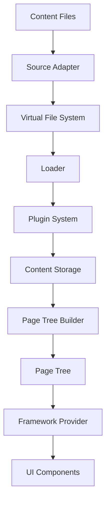

## Overview

Fumadocs Core is built on a modular, plugin-based architecture that separates concerns between content loading, page tree generation, and framework integration. The architecture enables framework-agnostic documentation sites with powerful content management capabilities.

## Core Components

The Fumadocs Core architecture consists of four primary layers:

<Steps>
  <Step title="Content Layer">
    Source adapters transform raw content files into a unified virtual file system
  </Step>
  <Step title="Processing Layer">
    Plugins transform and enhance content during the build process
  </Step>
  <Step title="Page Tree Layer">
    The page tree builder generates hierarchical navigation structures
  </Step>
  <Step title="Framework Layer">
    Framework adapters integrate with Next.js, React Router, and other frameworks
  </Step>
</Steps>

## Architecture Diagram



## Virtual File System

At the heart of Fumadocs is an in-memory virtual file system that normalizes content from various sources:

```typescript packages/core/src/source/storage/file-system.ts
export class FileSystem<File> {
  files = new Map<string, File>();
  folders = new Map<string, string[]>();

  read(path: string): File | undefined {
    return this.files.get(path);
  }

  readDir(path: string): string[] | undefined {
    return this.folders.get(path);
  }

  write(path: string, file: File): void {
    if (!this.files.has(path)) {
      const dir = dirname(path);
      this.makeDir(dir);
      this.readDir(dir)?.push(path);
    }
    this.files.set(path, file);
  }
}
```

<Note>
The virtual file system provides a consistent API regardless of whether content comes from the local filesystem, a CMS, or a remote API.
</Note>

## Content Storage

Content files are normalized into two types stored in `ContentStorage`:

<CodeGroup>
```typescript Page Files
interface ContentStoragePageFile<Config> {
  path: string;
  absolutePath?: string;
  format: 'page';
  slugs: string[];
  data: Config['pageData'];
}
```

```typescript Meta Files
interface ContentStorageMetaFile<Config> {
  path: string;
  absolutePath?: string;
  format: 'meta';
  data: Config['metaData'];
}
```
</CodeGroup>

## Plugin System

Fumadocs uses a powerful plugin system for extending functionality:

```typescript packages/core/src/source/loader.ts
interface LoaderPlugin<Config> {
  name?: string;
  enforce?: 'pre' | 'post';
  
  // Modify loader configuration
  config?: (config: ResolvedLoaderConfig) => ResolvedLoaderConfig | void;
  
  // Transform content storage after loading
  transformStorage?: (context: { storage: ContentStorage }) => void;
  
  // Transform generated page tree
  transformPageTree?: PageTreeTransformer;
}
```

### Built-in Plugins

Fumadocs Core includes several essential plugins:

<CardGroup cols={2}>
  <Card title="Slugs Plugin" icon="link">
    Generates URL slugs from file paths with proper encoding for non-ASCII characters
  </Card>
  <Card title="Icon Plugin" icon="image">
    Resolves icon references from icon libraries like Lucide
  </Card>
  <Card title="Fallback Transformer" icon="globe">
    Creates fallback page trees for localized content
  </Card>
  <Card title="Status Badges" icon="tag">
    Adds status indicators (Beta, Deprecated, etc.) to pages
  </Card>
</CardGroup>

## Loader System

The `loader()` function is the entry point for processing content:

```typescript packages/core/src/source/loader.ts
export function loader<Config, I18n>(
  source: Source<Config>,
  options: LoaderOptions<{ source: Config; i18n: I18n }>
): LoaderOutput {
  // 1. Build content storage (virtual file system)
  const storage = i18n 
    ? createContentStorageBuilder(config).i18n() 
    : createContentStorageBuilder(config).single();
  
  // 2. Run plugins to transform storage
  for (const plugin of plugins) {
    plugin.transformStorage?.({ storage });
  }
  
  // 3. Build page tree from storage
  const pageTree = new PageTreeBuilder(storage, options).root();
  
  // 4. Return loader output with utility functions
  return {
    pageTree,
    getPage,
    getPages,
    getPageTree,
    // ... more utilities
  };
}
```

<Accordion title="Loader Output Methods">
The loader returns an object with methods for:
- **getPage()** - Retrieve page by slugs
- **getPages()** - List all pages (optionally filtered by language)
- **getPageTree()** - Get navigation tree for a locale
- **getPageByHref()** - Resolve relative file paths and URLs
- **generateParams()** - Generate static params for SSG
- **serializePageTree()** - Serialize for non-RSC environments
</Accordion>

## Framework Abstraction

Fumadocs abstracts framework-specific APIs through a unified provider:

```typescript packages/core/src/framework/index.tsx
interface Framework {
  usePathname: () => string;
  useParams: () => Record<string, string | string[]>;
  useRouter: () => Router;
  Link?: FC<LinkProps>;
  Image?: FC<ImageProps>;
}

export function FrameworkProvider({ children, ...framework }: Framework) {
  return (
    <FrameworkContext value={framework}>
      {children}
    </FrameworkContext>
  );
}
```

This enables Fumadocs UI components to work with Next.js, React Router, TanStack Router, and Waku without modification.

<Tabs>
  <Tab title="Next.js">
    ```typescript
    import { FrameworkProvider } from 'fumadocs-core/framework';
    import { usePathname, useParams, useRouter } from 'next/navigation';
    import NextLink from 'next/link';
    import NextImage from 'next/image';

    <FrameworkProvider
      usePathname={usePathname}
      useParams={useParams}
      useRouter={useRouter}
      Link={NextLink}
      Image={NextImage}
    />
    ```
  </Tab>
  <Tab title="React Router">
    ```typescript
    import { FrameworkProvider } from 'fumadocs-core/framework';
    import { useLocation, useParams, useNavigate } from 'react-router-dom';

    <FrameworkProvider
      usePathname={() => useLocation().pathname}
      useParams={useParams}
      useRouter={() => ({ push: useNavigate(), refresh: () => {} })}
    />
    ```
  </Tab>
</Tabs>

## URL Generation

The loader generates URLs based on slugs and i18n configuration:

```typescript packages/core/src/source/loader.ts
export function createGetUrl(baseUrl: string, i18n?: I18nConfig) {
  const baseSlugs = baseUrl.split('/');

  return (slugs: string[], locale?: string) => {
    const hideLocale = i18n?.hideLocale ?? 'never';
    let urlLocale: string | undefined;

    if (hideLocale === 'never') {
      urlLocale = locale;
    } else if (hideLocale === 'default-locale' && locale !== i18n?.defaultLanguage) {
      urlLocale = locale;
    }

    const paths = [...baseSlugs, ...slugs];
    if (urlLocale) paths.unshift(urlLocale);

    return `/${paths.filter((v) => v.length > 0).join('/')}`;
  };
}
```

<Warning>
Slugs are automatically URI-encoded by the slugs plugin to support non-ASCII characters in URLs.
</Warning>

## Type Safety

Fumadocs maintains end-to-end type safety:

```typescript
import { loader } from 'fumadocs-core/source';
import { source } from './source';

const docs = loader({
  source,
  baseUrl: '/docs',
});

// Fully typed based on your source configuration
type PageType = InferPageType<typeof docs>;
type MetaType = InferMetaType<typeof docs>;
```

## Performance Optimizations

<AccordionGroup>
  <Accordion title="Lazy Page Tree Generation">
    Page trees are generated lazily and cached, only building when first accessed.
  </Accordion>
  <Accordion title="Content Indexing">
    Pages are indexed by slugs and paths for O(1) lookup performance.
  </Accordion>
  <Accordion title="Incremental Builds">
    The plugin system supports incremental transformations for fast rebuilds.
  </Accordion>
  <Accordion title="Tree Shaking">
    Framework adapters are separate entry points for optimal bundle sizes.
  </Accordion>
</AccordionGroup>

## Next Steps

<CardGroup cols={2}>
  <Card title="Content Sources" icon="database" href="/concepts/content-sources">
    Learn about source adapters and content loading
  </Card>
  <Card title="Page Tree" icon="sitemap" href="/concepts/page-tree">
    Understand page tree structure and navigation
  </Card>
  <Card title="Routing" icon="route" href="/concepts/routing">
    Explore URL generation and routing strategies
  </Card>
  <Card title="Plugin Development" icon="plug" href="/advanced/plugins">
    Build custom plugins to extend Fumadocs
  </Card>
</CardGroup>