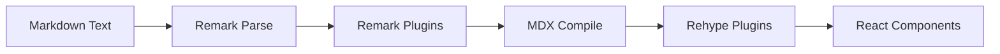

Fumadocs provides a comprehensive MDX processing system built on top of the unified/remark/rehype ecosystem. It includes custom plugins for enhanced syntax, code highlighting, and content transformations.

## Architecture

The MDX processing pipeline consists of three main layers:

### 1. Remark Plugins (Markdown AST)

Remark plugins operate on the Markdown Abstract Syntax Tree (MDAST) before MDX compilation. They handle:

- **Syntax Extensions**: Admonitions, steps, code tabs
- **Content Processing**: Headings, images, structure extraction
- **TOC Generation**: Table of contents from headings

### 2. Rehype Plugins (HTML AST)

Rehype plugins work on the HTML AST (HAST) after MDX compilation:

- **Code Highlighting**: Shiki-powered syntax highlighting
- **Code Transformations**: Line numbers, highlighting, diff markers
- **TOC Rendering**: Convert heading data to navigable TOC

### 3. Shiki Transformers

Shiki transformers enhance code blocks with:

- **Language Icons**: Automatic language detection and icon display
- **Notation Support**: Highlight, focus, diff, word highlighting
- **Twoslash Integration**: TypeScript type information in code

## Available Plugins

### Remark Plugins

| Plugin | Purpose | Location |
|--------|---------|----------|
| `remarkHeading` | Generate heading IDs and TOC | `/packages/core/src/mdx-plugins/remark-heading.ts:41` |
| `remarkStructure` | Extract structured data for search | `/packages/core/src/mdx-plugins/remark-structure.ts:155` |
| `remarkImage` | Optimize images for Next.js | `/packages/core/src/mdx-plugins/remark-image.ts:82` |
| `remarkAdmonition` | Docusaurus-style callouts | `/packages/core/src/mdx-plugins/remark-admonition.ts:22` |
| `remarkDirectiveAdmonition` | Directive-based admonitions | `/packages/core/src/mdx-plugins/remark-directive-admonition.ts:29` |
| `remarkCodeTab` | Tabbed code blocks | `/packages/core/src/mdx-plugins/remark-code-tab.ts:178` |
| `remarkSteps` | Numbered step sequences | `/packages/core/src/mdx-plugins/remark-steps.ts:27` |

### Rehype Plugins

| Plugin | Purpose | Location |
|--------|---------|----------|
| `rehypeCode` | Syntax highlighting with Shiki | `/packages/core/src/mdx-plugins/rehype-code.ts:18` |
| `rehypeToc` | Generate table of contents | `/packages/core/src/mdx-plugins/rehype-toc.ts` |

## Basic Configuration

Here's how to configure MDX processing in your Next.js application:

```ts title="source.config.ts"
import { defineConfig } from 'fumadocs-mdx/config';
import { rehypeCode } from 'fumadocs-core/mdx-plugins';

export default defineConfig({
  mdxOptions: {
    rehypePlugins: [
      [rehypeCode, {
        themes: {
          light: 'github-light',
          dark: 'github-dark',
        },
      }],
    ],
    remarkPlugins: [
      // Add your remark plugins here
    ],
  },
});
```

## Unified Pipeline

The processing flow follows this sequence:



1. **Parse**: Markdown text → MDAST
2. **Remark**: Transform markdown syntax
3. **Compile**: MDAST → HAST (with MDX)
4. **Rehype**: Transform HTML/JSX
5. **Output**: React components

## Features

### Automatic Heading IDs

Headings automatically receive slugified IDs:

```md
## Hello World
<!-- Generates: <h2 id="hello-world">Hello World</h2> -->

## Custom ID [#custom]
<!-- Generates: <h2 id="custom">Custom ID</h2> -->
```

### Image Optimization

Images are automatically optimized for Next.js:

```md

<!-- Transforms to Next.js Image with width/height -->
```

### Code Block Enhancements

Code blocks support extensive metadata:

```md
```typescript title="example.ts" {2-4}
function hello() {
  // These lines are highlighted
  console.log('Hello');
  return true;
}
```
```

### Structured Data

Content is automatically indexed for search:

```ts
import { remarkStructure } from 'fumadocs-core/mdx-plugins';

// In your MDX config
remarkPlugins: [
  [remarkStructure, {
    // Export structured data as variable
    exportAs: 'structuredData',
  }],
]
```

## Next Steps

<Cards>
  <Card title="Syntax Extensions" href="/markdown/syntax">
    Learn about admonitions, steps, and custom syntax
  </Card>
  <Card title="Plugin Configuration" href="/markdown/plugins">
    Configure remark and rehype plugins
  </Card>
  <Card title="Code Blocks" href="/markdown/code-blocks">
    Customize code syntax highlighting
  </Card>
  <Card title="Twoslash" href="/markdown/twoslash">
    Add TypeScript type information to code blocks
  </Card>
</Cards>
